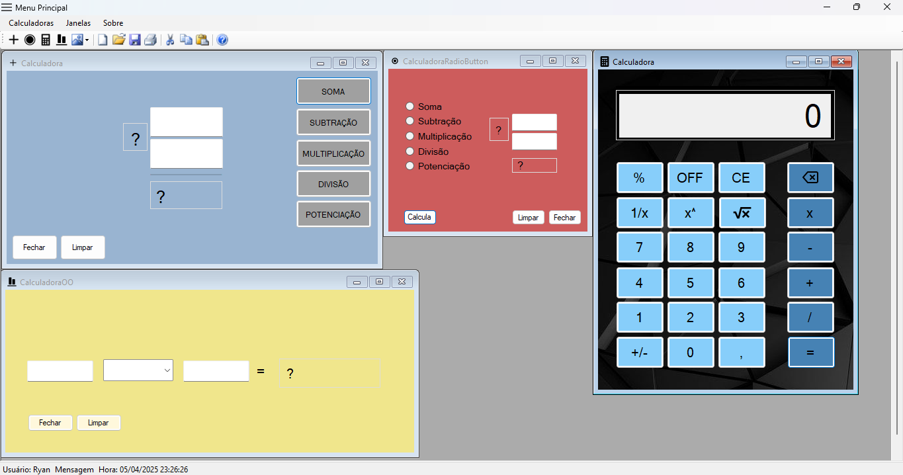

<h1>Another project I made for school, this time using Microsoft Forms (.NET Framework) and programming in C#</h1>

In this project I made various types of calculators, 
  using different methods to calculate. I use buttons, 
  radiobuttons, buttons for the numbers (normal calculator, 
  but in my project I call it 'The Super Calculator' 
  and classes)

